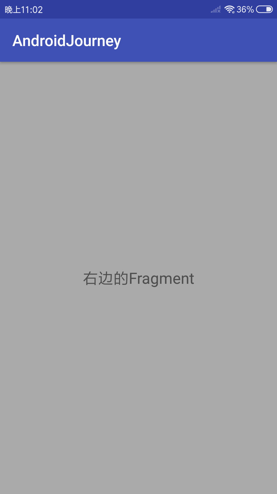
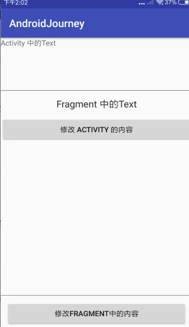
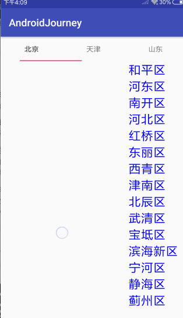
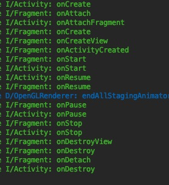
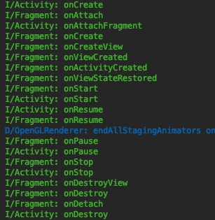

# Fragment

> 文章来源：MasteringAndroid
>
> 作者：李腾
>
> 审阅者：
>
> 贡献者：

### 什么是 Fragment

​	Fragment意为碎片，片段。在Google的官方文档介绍，Fragment是Activity中的行为或用户界面部分。

​	我们可以把多个Fragment放到一个Activity里，也可以把一个Fragment在多个Activity里复用。我们可以把Fragment理解为Activity的一个模块。它有自己的生命周期，它可以响应自己的交互事件。在程序运行中我们可以随意的在Activity中添加或者移除Fragment。

​	Fragment 必须始终嵌入在 Activity 中，其生命周期直接受宿主 Activity 生命周期的影响。例如，当 Activity 暂停时，其中的所有片段也会暂停；当 Activity 被销毁时，其中的所有 Fragment 也会被销毁。 在Fragment应用中有一个事务的概念，我们可以通过Fragment的事务，来操作Fragment。当 Activity 正在运行时，我们可以独立操作每个Fragment，通过事务添加或移除它们。 当执行这些事务时，我们也可以将其添加到由 Activity 管理的回退栈；回退栈(back stack )中的每个实体都是一条已经提交的关于Fragment的事务(FragmentTransaction)的记录。 回退栈(back stack )让用户可以通过从回退栈中弹出Fragment事务的方式来达到回退的效果。

​	当我们将Fragment作为Activity布局的一部分添加到Activity中时，Fragment会存在于Activity的布局结构中的某个ViewGroup中。Fragment可以定义自己的布局，我们可以在布局文件中添加 Fragment ，将其作为一个`<fragment>`标签插入到Activity布局中。我们也可以通过Java代码将Fragment添加到一个已有的ViewGroup中。

​	**Fragment 不是必须要做为Activity布局的一部分，我们可以将没有UI的Fragment左右Activity中的一个不可见的工作线程**。Glide 中就存在两种无界面的Fragment用来存放RequestManager。([RequestManagerFragment](<https://github.com/bumptech/glide/blob/master/library/src/main/java/com/bumptech/glide/manager/RequestManagerFragment.java>)，[SupportRequestManagerFragment](<https://github.com/bumptech/glide/blob/master/library/src/main/java/com/bumptech/glide/manager/SupportRequestManagerFragment.java>))。

​	**Fragment是一个轻量级的，可复用的，模块化的UI组件。**

### 为什么会有 Fragment？

​	Fragment 是在 Android 3.0 (API level 11)时引入的。Fragment 的出现一方面是为了解决Activity太重导致无法更细粒度的复用的问题；另一方面是为了处理在不同屏幕上UI组件的布局问题，尤其是大屏幕，比如平板和电视。另外，由于Android系统组件ActivityManager进行Activity调度的时候本身涉及较多的计算，通过Fragment 代替Activity实现界面切换，能够解决因ActivityManager调度耗时较久的问题。

​	在开发中大型的应用时，如果遇到特别复杂的界面，Activity就会显得特别复杂，就会变得臃肿。如果使用Fragment把Activity分割，就会很好的缓解这种情况。将Activity分割成多个Fragment后，Activity就可以脱出身来，不再去处理大量的View了，它只需要管理Fragment或者少量的View。

​	虽然它是在Android 3.0时加入的，Google也提供了support包来支持之前的版本，现在又将其拆分到AndroidX 里。这说明Google对Fragment的重视，并且提倡使用Fragment。我们这里使用的是 AndroidX。

### 初探 Fragment

​	上面提到Fragment有自己的生命周期，它的生命周期依赖于Activity，但是比Activity的生命周期更复杂。Fragment 跟 Activity的使用有些类似；需要创建一个子类去继承Fragment，然后实现 Fragment 的生命周期回调方法。Android开发者官网提供了一张Fragment的完整的生命周期图，记录了 Framgent 被添加以后的生命周期方法的走向：


Fragment 的生命周期方法很多，下面就一一列举介绍：

- onAttach(Activity)：一旦Fragment与Activity有关联就会被调用。这个方法已经在API 23 被废弃了。我们程序在 Android 如果需要在API 23 或者以上就需要使用 onActtach(Context) 。
- onCreate(Bundle)：系统会在创建Fragment阶段调用 onCreate() 方法。
- onCreateView(LayoutInflater, ViewGroup, Bundle)：系统会在Fragment首次绘制界面时调用该方法，我们需要在这里提供我们需要绘制的View，提交给系统，如果不提界面，可以返回 `null`。
- onActivityCreated(Bundle)：通知Fragment，它所依附的宿主Activity已经完成 Activty.onCreate()的调用；并且当前的Fragment 已经完成了对界面的实例化。我们可以在这里做一些最后的初始化。比如恢复Fragment重建前的状态，或者绑定控件。该回调方法告诉Fragment它的宿主Activity已经已经和它完全关联在一起了。如果我们要重写 这个方法，必须调用父类的实现。
- onStart()：Fragment对用户可见时调用，通常在调用该方法之前宿主Activity必须是可见的，也就是说 Activity.onStart() 必须已经完成调用。如果我们要重写 这个方法，必须调用父类的实现。
- onResume()：Fragment可以与用户进行交互，通常在调用该方法之前宿主Activity必须是可交互的，也就是说当Activity.onResume()调用后它才会调用。也就是说Activity.onResume()必须已经完成调用。
- onPause()：Fragment不能与用户进行交互，通常在调用是与宿主Activity的Activity.onPause()绑定一起的。如果我们要重写这个方法，必须调用父类的实现。
- onStop()：Fragment 对用户不可见时调用。通常在调用是与宿主Activity的Activity.onStop()绑定一起的，也就是说当Activity.onStop()调用后它才会调用。如果我们要重写这个方法，必须调用父类的实现。
- onDestroyView()：当在onCreateView()方法中创建的View从Fragment分离时才会调用。如果Fragment需要再次显示，会创建一个新的View对象。不管onCreateView()返回的是否为空View，它都会被调用。它会在View的状态被保存之后，View被移除之前调用。如果我们要重写这个方法，必须调用父类的实现。
- onDestroy()：当Fragment被销毁时调用。我们可以在这里做一些清理工作。比如一些对象的置空，或者是一些监听的移除。如果我们要重写这个方法，必须调用父类的实现。
- onDetach()：当Fragment 从宿主Activity分离时调用。如果我们要重写这个方法，必须调用父类的实现。

上面的是Fragment的生命周期方法，但是除了这些生命周期方法，还有其它的几个方法也很重要：

- onViewStateRestored(Bundle)：Fragment所有被保存的状态已经完成恢复后调用。我们可以在这里做一些基于已保存状态的初始化。比如我们的CheckBox是否被勾选。它会在onActivityCreated(Bundle)之后，onStart() 之前调用。如果我们要重写这个方法，必须调用父类的实现。
- onSaveInstanceState (Bundle)：在这个回调方法里，一般会要求我们保存当前Fragment的动态的状态信息，以便于在之后Fragment实例重建后恢复之前的状态。这里通过Bundle来存储状态，如果需要恢复状态，我们可以在 `onCreate(Bundle)`，`onCreateView(LayoutInflater, ViewGroup, Bundle) ，onActivityCreated(Bundle)`，中进行恢复操作，它们都携带一个Bundle参数，我们可以从Bundle中取出保存的状态。这个方法会在 onDestroy() 之前的任何时机被调用。这个方法与 Activity.onSaveInstanceState(Bundle) 表现是一致的。Fragment 状态的保存与否与其宿主Activity是否需要保存其状态有关。
- setRetainInstance (boolean)：当Activity重建时，Fragment实例是否保留，而不用重建。如果将Fragment加入到回退栈中，那么这个方法就不适用了。如果在setRetainInstance(boolean) 中传入true，Fragment的生命周期会略有不同。

### 静态用法

​	这里说的静态用法，是指将Fragment 作为`<fragment>` 标签插入到Activity布局中。这样就将Fragment写死了，不能在程序运行期间动态的对 Fragment 进行添加、移除等操作。

​	`<fragment>` 有两个属性 :

- `android:name` : 用来指定Fragment的路径，指定要在布局中实例化的 `Fragment` 类。
- `android:id`：fragment 的唯一 ID；每一个Fragment都需要一个唯一的标识，可以通过 id 进行标识，我们可以在 Java 代码中通过 id 获取该Fragment。
- `android:tag`: fragment 的唯一 字符串；每一个Fragment都需要一个唯一的标识，可以通过 tag 进行标识。

每一个Fragment都需要一个唯一的标识，可以通过 tag或者id 进行标识。如果没有提供这两个值，系统会使用容器视图的id 。

下面我在Activity布局中使用 `<fragment>`:

```xml
<?xml version="1.0" encoding="utf-8"?>
<LinearLayout xmlns:android="http://schemas.android.com/apk/res/android"
    xmlns:tools="http://schemas.android.com/tools"
    android:layout_width="match_parent"
    android:layout_height="match_parent"
    android:orientation="horizontal"
    tools:context=".fragment.items.statics.FragmentStaticUseActivity">
    <fragment
        android:id="@+id/fragment_left"
        android:name="vip.liteng.ui.fragment.items.statics.LeftFragment"
        android:layout_width="0dp"
        android:layout_height="match_parent"
        android:layout_weight="1"
        android:tag="tag_fragment_left" />

    <fragment
        android:id="@+id/fragment_right"
        android:name="vip.liteng.ui.fragment.items.statics.RightFragment"
        android:layout_width="0dp"
        android:layout_height="match_parent"
        android:layout_weight="1"
        android:tag="tag_fragment_right" />
</LinearLayout>
```

其关联的Activity代码如下：

```java
public class FragmentStaticUseActivity extends AppCompatActivity {
    @Override
    protected void onCreate(Bundle savedInstanceState) {
        super.onCreate(savedInstanceState);
        setContentView(R.layout.activity_fragment_static_use);
    }
}
```

在上面布局中，我们添加了两个`<fragment>` 标签，指向了两个 Fragment，一个是LeftFragment ，一个是 RightFragment 。两个 Fragment 平分了整个布局。而Activity只是在onCreate中显示了该布局，并没有做其他操作。

然后我们看一下 两个 Fragment 的代码:

```java
public class RightFragment extends Fragment {
    private View mRootView;
    private TextView mTvRightText;

    public RightFragment() {
        // Required empty public constructor
    }

    @Override
    public View onCreateView(LayoutInflater inflater, ViewGroup container,
                             Bundle savedInstanceState) {
        mRootView = inflater.inflate(R.layout.fragment_right, container, false);
        return mRootView;
    }

    @Override
    public void onActivityCreated(@Nullable Bundle savedInstanceState) {
        super.onActivityCreated(savedInstanceState);
        mTvRightText = mRootView.findViewById(R.id.tv_right);
    }
}
```

```java
public class LeftFragment extends Fragment {
    private View mRootView;
    private TextView mTvLeftText;

    public LeftFragment() {
        // Required empty public constructor
    }

    @Override
    public View onCreateView(LayoutInflater inflater, ViewGroup container,
                             Bundle savedInstanceState) {
        mRootView = inflater.inflate(R.layout.fragment_left, container, false);
        return mRootView;
    }

    @Override
    public void onActivityCreated(@Nullable Bundle savedInstanceState) {
        super.onActivityCreated(savedInstanceState);
        mTvLeftText = mRootView.findViewById(R.id.tv_left);
    }
}
```

两个Fragment 里面都只含有一个TextView，代码很简单，不在贴了。

现在我们看显示效果：


#### 在Activity中操作Fragment

到这里，我们已经可以将Fragment嵌入到Activity中使用了，但是我们应该在怎么样将在Activity中操作Fragment呢？这就用到了我们设置的 id 或者 tag 。

​	另外我们还需要知道 `FragmentManager` 这个类，这个类顾名思义，就是用来管理 Fragment 的。

前面提到过，Android 在是 API 11 时才引用了Fragment。为此还引入了 Support Library 来兼容之前的版本。所有我们有两种方式来获取 FragmentManager ：

```java
// 通过 Support Library 获取
android.support.v4.app.FragmentManager supportFragmentManager = getSupportFragmentManager();
// 直接获取
android.app.FragmentManager fragmentManager = getFragmentManager();
```

通过包名，我们可以清楚的看到的，包含 `support` 的是引入的 Support Library，另外一个Android SDK自带的。不过呢在API 28 中 `getFragmentManager()` 被废弃掉了。而且 Support Library 中Fragment的使用方式跟 Android SDK 中的使用方式是非常类似，所以，后面的所有的涉及到的 Fragment 的相关操作都使用 Support Library 。

##### 获取Fragment

​	因为在静态用法中，我们无法移除已经添加的Fragment，但是可以隐藏和重新显示。要隐藏指定的Fragment，首先我们需要在Activity中获取到Fragment。FragmentManger提供了两个方法来获取已经添加的Fragment：

- findFragmentByTag
- findFragmentById

上面的其它代码不变，只修改Activity中的代码：

```java
public class FragmentStaticUseActivity extends AppCompatActivity {

    /** 在布局中给 fragment 设置的tag*/

    public static final String TAG_LEFT = "tag_fragment_left";
    public static final String TAG_RIGHT = "tag_fragment_right";

    LeftFragment mFragmentLeft;
    RightFragment mFragmentRight;

    @Override
    protected void onCreate(Bundle savedInstanceState) {
        super.onCreate(savedInstanceState);
        setContentView(R.layout.activity_fragment_static_use);

        // 通过 findFragmentByTag 获取 Fragment
        mFragmentLeft = (LeftFragment) getSupportFragmentManager().findFragmentByTag(TAG_LEFT);
        mFragmentRight = (RightFragment) getSupportFragmentManager().findFragmentByTag(TAG_RIGHT);

        // 通过 findFragmentById 获取 Fragment
        mFragmentLeft = (LeftFragment) getSupportFragmentManager().findFragmentById(R.id.fragment_left);
        mFragmentRight = (RightFragment) getSupportFragmentManager().findFragmentById(R.id.fragment_right);

        // 隐藏左侧的Fragment
        getSupportFragmentManager().beginTransaction().hide(mFragmentLeft).commit();
    }
}
```

上面的代码中，我们通过FragmentTransaction把左侧的Fragment隐藏掉，效果如下:



在静态用法中，除了可以隐藏Fragment之外，还可以做以下操作：

- 将已经隐藏 Fragment 重新显示

  ```
  getSupportFragmentManager().beginTransaction().show(mFragmentLeft).commit();
  ```

- 添加新的Fragment

- ```java
  // R.id.container 为需要添加 Fragment 的 ViewGroup 的 id
          getSupportFragmentManager().beginTransaction().add(R.id.container,mTempFragment).commit();
  ```

### 动态用法

​	动态用法就是可动态的操作Fragment，不需要在布局中加入`<fragment>` 标签，只需要在需要添加的 Fragment 的ViewGoup容器即可。

​	在介绍动态用法之前，需要在重新认识一下  FragmentTransaction 和 回退栈。

#### FragmentTransaction

​	FragmentTransaction 与 FragmentManager 关联在一起，我们可以通过 FragmentTransaction 开启一系列的对Fragment的操作。FragmentTransaction 有几个很重要和比较常用的方法：

-  add( int containerViewId,Fragment fragment, String tag)：往Activity中指定的容器中添加一个Fragment；containerViewId为某个ViewGroup容器，containerViewId 为0时不会添加到任何的容器；tag也可以为空。
-  remove(Fragment fragment)：移除一个已有的Fragment；如果这个Fragment被加入到一个容器中，它的视图也会被移除。
- replace(int containerViewId,Fragment fragment,String tag)：将已有的Fragment替换。相当于对Fragment先进行remove(),然后再add()。containerViewId为某个ViewGroup容器，tag也可以为空。
- hide(Fragment fragment)：隐藏已经添加进容器的Fragment，但不会销毁，只会隐藏其View。跟下面的show()对应。
- show(Fragment fragment)：显示上面使用hide()隐藏的Fragment，该Fragment是已经加入的容器中并且没有被销毁，show()会将隐藏掉的Fragment的View重新显示。
- detach(Fragment fragment):将Fragment从UI上移除。相当于把这个Fragment放到回退栈，虽然将它将它从UI移除，但是FragmentManger依然维护着它。
- attach(Fragment fragment):如果调用上面的detach()方法，将Fragment从UI移除，可以调用这个方法重建视图并将它附着到UI上并且显示。
- commit()：调度一个事务的提交；这个提交不会立即执行，它会发送到主线程的队列中，当主线程准备好执行它的时候才会执行，所以说这个操作是异步的，如果想立即执行该事物的提交，可以在之后调用 FragmentManager.executePendingTransactions()，将操作变为同步的。不过后来Google提供了一个 commitNow() 的方法可以保证事务的立即执行。同一个事务不能重复调用该方法，否则会抛出 IllegalStateException 。在执行这个方法时，首先会判断是否需要将当前的操作添加到回退栈中；然后会检查Activity中的Fragment是否保存过状态，即Activity是否调用过 `onSaveInstanceState(Bundle outState)`，如果保存过，否则会抛出 IllegalStateException。因为如果Activity在保存状态后，再调用commit()，当Activity需要恢复它的状态时，commit()提交的事务状态的可能会丢失。如果要解决这个问题可以使用 commitAllowingStateLoss()。也可以控制它的提交时机，避免在 Activity 调用 `onSaveInstanceState(Bundle outState)` 之后提交事务。
- commitAllowingStateLoss()：跟上面的commit()类似，但是它允许在Activity的状态保存之后提交事务；这样做有些危险，因为如果Activity需要恢复它之前的状态，很容易造成提交事务的丢失，所以这个操作最好在UI状态意外更改的时候执行。
- commitNow()：将当前要提交的事务立即执行，这个操作是同步的。它可以避免我们不小心执行了一些我们不希望的执行的事务。对比` commit() + FragmentManager.executePendingTransactions() `，更推荐使用 commitNow() 提交事务。不过使用 commitNow() ，就不能将事务加入到回退栈中了。因为如果我们之前使用了 commit()提交了一个事务，然后紧接着又使用commitNow() 提交了一个事务；两个事务都想加入到回退栈中，由于commit() 是异步的，commitNow() 是同步的，这个时候，就不知道哪个事务要先加入到回退栈中了，这是一种不确定的状态，系统无法提供任何保证来确保添加的顺序，当然系统根本就不支持这个操作。同样的它也会检查Activity中的Fragment是否保存过状态，即Activity是否调用过 `onSaveInstanceState(Bundle outState)`，如果保存过，否则会抛出 IllegalStateException。为了解决这个问题Google提供了commitNowAllowingStateLoss()。
- commitNowAllowingStateLoss()：这个方法跟 commitAllowingStateLoss() 和 commitNow() 的组合很像，它可以立即提交当前的事务，并且会忽略掉Activit是否保存了状态。

#### 回退栈

​	说是一个栈，但是其实它的实现方式是一个 ArrayList ，它的每一个Item都是一个 `BackStackRecord`，而`BackStackRecord`是 `FragmentTransaction` 实现类。所以说回退栈里保存的是一个个的 `FragmentTransaction`  。

```java
getSupportFragmentManager()
	.beginTransaction()
	.add(int containerViewId,Fragment fragment, String tag)
	.hide(Fragment fragment)
	.addToBackStack(String name)
	.commit();
```

我们每次调用类似上面代码的时候就会将一个 `FragmentTransaction` 加入到回退栈中。当我们调用 `FragmentManager.popBackStack()` ，就会将栈顶的 `FragmentTransaction` 移除掉，然后次顶的 `FragmentTransaction` 就会占据栈顶的位置，并且其中的 Framgent 展示到Activity上。

关于回退栈大概会有以下的操作：

- FragmentTransaction.addToBackStack(String name) ：将事务入栈，参数name为记录回退栈当前状态的名字，也可以理解为入栈的事务的名字。当出栈时会用到name。
- FragmentManager.popBackStack()：将栈顶的事务出栈，该操作是异步的，可以和 FragmentManager.executePendingTransactions()配合，将操作改为同步。
- FragmentManager.popBackStack(String name, int flags)：将栈中指定名字的事务出栈，该操作是异步的，可以和 FragmentManager.executePendingTransactions()配合，将操作改为同步。
- FragmentManager.popBackStackImmediate(String name, int flags)：将栈中指定名字的事务出栈。该操作是同步的。

#### 效果展示

下面我们通过一系列的示例来看效果：

首先我们新建一个布局来作为各个Fragment的容器，我们将布局分为三个部分，上部，中部和下部来分别展示各个Fragment，通过点击下部的按钮来展示各个效果：

```xml
<?xml version="1.0" encoding="utf-8"?>
<LinearLayout xmlns:android="http://schemas.android.com/apk/res/android"
    xmlns:tools="http://schemas.android.com/tools"
    android:id="@+id/container"
    android:layout_width="match_parent"
    android:layout_height="match_parent"
    android:orientation="vertical"
    tools:context=".fragment.items.dynamic.FragmentDynamicUseActivity">
    <FrameLayout
        android:id="@+id/container_top"
        android:layout_width="match_parent"
        android:layout_height="0dp"
        android:layout_weight="1" />
    <FrameLayout
        android:id="@+id/container_middle"
        android:layout_width="match_parent"
        android:layout_height="0dp"
        android:layout_weight="1" />
    <FrameLayout
        android:id="@+id/container_bottom"
        android:layout_width="match_parent"
        android:layout_height="0dp"
        android:layout_weight="1" />
    <LinearLayout
        android:layout_width="match_parent"
        android:layout_height="wrap_content"
        android:orientation="horizontal">
        <Button
            android:layout_width="0dp"
            android:layout_height="wrap_content"
            android:layout_weight="1"
            android:onClick="clickAddFragment"
            android:text="add" />
        <Button
            android:layout_width="0dp"
            android:layout_height="wrap_content"
            android:layout_weight="1"
            android:onClick="clickReplaceFragment"
            android:text="replace" />
        <Button
            android:layout_width="0dp"
            android:layout_height="wrap_content"
            android:layout_weight="1"
            android:onClick="clickRemoveFragment"
            android:text="remove" />
    </LinearLayout>
    <LinearLayout
        android:layout_width="match_parent"
        android:layout_height="wrap_content"
        android:orientation="horizontal">
        <Button
            android:layout_width="0dp"
            android:layout_height="wrap_content"
            android:layout_weight="1"
            android:onClick="clickHideFragment"
            android:text="hide" />
        <Button
            android:layout_width="0dp"
            android:layout_height="wrap_content"
            android:layout_weight="1"
            android:onClick="clickShowFragment"
            android:text="show" />
    </LinearLayout>
    <LinearLayout
        android:layout_width="match_parent"
        android:layout_height="wrap_content"
        android:orientation="horizontal">
        <Button
            android:layout_width="0dp"
            android:layout_height="wrap_content"
            android:layout_weight="1"
            android:onClick="clickAddFragmentToBackStack"
            android:text="addToBackStack" />
        <Button
            android:layout_width="0dp"
            android:layout_height="wrap_content"
            android:layout_weight="1"
            android:onClick="clickPopFragmentFromBackStack"
            android:text="popBackStack" />
    </LinearLayout>
</LinearLayout>
```

各种的操作如下，这里把Fragment的class类的name作为 Fragment的 tag 和 栈中状态的名称：

```java
    private void addFragment(int contentViewId, Fragment fragment, boolean addBackStack) {
        String tagOrName = fragment.getClass().getName();
        FragmentTransaction transaction = mFragmentManager.beginTransaction();
        transaction.add(contentViewId, fragment, tagOrName);
        if (addBackStack) {
            transaction.addToBackStack(tagOrName);
        }
        transaction.commit();
    }

    private void replaceFragment(int contentViewId, Fragment fragment, boolean addBackStack) {
        String tagOrName = fragment.getClass().getName();
        FragmentTransaction transaction = mFragmentManager.beginTransaction();
        transaction.replace(contentViewId, fragment, tagOrName);
        if (addBackStack) {
            transaction.addToBackStack(tagOrName);
        }
        transaction.commit();
    }

    private void removeFragment(String fragmentTag) {
        Fragment fragment = mFragmentManager.findFragmentByTag(fragmentTag);
        if (fragment != null) {
            mFragmentManager.beginTransaction().remove(fragment).commit();
        }
    }

    private void hideFragment(String fragmentTag) {
        Fragment fragment = mFragmentManager.findFragmentByTag(fragmentTag);
        if (fragment != null) {
            mFragmentManager.beginTransaction().hide(fragment).commit();
        }
    }

    private void showFragment(String fragmentTag) {
        Fragment fragment = mFragmentManager.findFragmentByTag(fragmentTag);
        if (fragment != null) {
            mFragmentManager.beginTransaction().show(fragment).commit();
        }
    }

    private void popFragmentFromBackStack(final String backStackStateName) {
        // mFragmentManager.popBackStack(backStackStateName, 0);
        // mFragmentManager.popBackStack(backStackStateName, FragmentManager.POP_BACK_STACK_INCLUSIVE);

         mFragmentManager.popBackStackImmediate(backStackStateName, FragmentManager.POP_BACK_STACK_INCLUSIVE);

//        new Thread(new Runnable() {
//            @Override
//            public void run() {
//                mFragmentManager.popBackStack(
//                        backStackStateName, FragmentManager.POP_BACK_STACK_INCLUSIVE);
//            }
//        }).start();
    }
```

动态的效果如下：


### Fragment 与 Activity 交互

​	关于Activity与Fragment交互，最常用的方式是用接口回调。

​	如果我们想在Fragment里修改Activity中的内容，就需要定义一个回调接口，在 Fragment 调用，在Activity中实现。比如我们要在通过点击 Fragment中的按钮，修改Activity中的文字；我们可以在Fragment中定义一个接口，然后我们让Activity实现这个接口，当我们Fragment中点击按钮的时候，调用接口方法。

​	如果我们想在Activity中修改Fragment中的内容，我们可以在Activity中获取到Fragment，直接调用Fragment中的修改方法。

​	首先我们看Fragment中的代码：

```java
public class InteractionFragment extends Fragment implements View.OnClickListener {

    private TextView mText;
    private Button mBtnModify;

    private OnFragmentInteractionListener mListener;

    public InteractionFragment() {
        // Required empty public constructor
    }

    public static InteractionFragment newInstance() {
        return new InteractionFragment();
    }

    @Override
    public View onCreateView(LayoutInflater inflater, ViewGroup container,
                             Bundle savedInstanceState) {
        View view = inflater.inflate(R.layout.fragment_interaction, container, false);
        mText = view.findViewById(R.id.tv_fragment_text);
        mBtnModify = view.findViewById(R.id.btn_modify_activity_text);
        mBtnModify.setOnClickListener(this);
        return view;
    }

    @Override
    public void onAttach(Context context) {
        super.onAttach(context);
        // 当 Fragment 与 Activity 关联后，我们可以在这里获取 Activity 的引用；
        // 由于Activity会实现我们定义的通信接口，我们将Activity强转成通信接口，
        // 这样就能通过接口调用Activity中实现的接口方法了
        if (context instanceof OnFragmentInteractionListener) {
            mListener = (OnFragmentInteractionListener) context;
        } else {
            throw new RuntimeException(
                    context.toString() + " must implement OnFragmentInteractionListener");
        }
    }

    /**
     * 修改当前Fragment中TextView的内容，由Activity调用
     *
     * @param text 修改的内容
     */
    public void modifyFragmentText(String text) {
        mText.setText(text);
    }

    @Override
    public void onDetach() {
        super.onDetach();
        mListener = null;
    }

    @Override
    public void onClick(View v) {
        if (v.getId() == R.id.btn_modify_activity_text) {
            mListener.onModifyActivityText("Fragment 修改 Activity 的内容");
        }
    }

    /**
     * 定义一个接口，用来与Activity中通信，这个接口需要Activity去实现
     */
    public interface OnFragmentInteractionListener {

        /**
         * 用来修改Activity中TextView的内容
         *
         * @param text 修改的内容
         */
        void onModifyActivityText(String text);
    }
}
```

然后看Activity:

```java
public class InteractionActivity extends AppCompatActivity implements InteractionFragment.OnFragmentInteractionListener {

    public static final int CONTAINER = R.id.container;

    private TextView mText;

    private FragmentManager mFragmentManager;

    private InteractionFragment mInteractionFragment;

    @Override
    protected void onCreate(Bundle savedInstanceState) {
        super.onCreate(savedInstanceState);
        setContentView(R.layout.activity_interaction);

        mText = findViewById(R.id.tv_activity_text);

        mFragmentManager = getSupportFragmentManager();

        mInteractionFragment = InteractionFragment.newInstance();
        addFragment(CONTAINER, mInteractionFragment, false);

    }

    public void clickModifyFragmentText(View view) {
        // 我们在 Activity 可以直接拿到Fragment的引用，可以直接修改 Fragment 中的内容
        mInteractionFragment.modifyFragmentText("Activity 修改 Fragment 的内容");
    }

    /**
     * Fragment中定义的接口方法，在Activity中实现，
     * 我们可以修改Activity中的内容，而触发修改是在 Fragment 中执行的
     *
     * @param text 修改的内容
     */
    @Override
    public void onModifyActivityText(String text) {
        mText.setText(text);
    }

    private void addFragment(int contentViewId, Fragment fragment, boolean addBackStack) {
        String tagOrName = fragment.getClass().getName();
        FragmentTransaction transaction = mFragmentManager.beginTransaction();
        transaction.add(contentViewId, fragment, tagOrName);
        if (addBackStack) {
            transaction.addToBackStack(tagOrName);
        }
        transaction.commit();
    }
}
```

然后我们看效果：



### Fragment 传递参数

​	在Fragment的API文档中强调，不要通过Fragment的子类在构造函数中添加参数的方式传递参数，如果需要传递参数需要用到 `setArguments (Bundle args)` , 并且可以通过 `getArguments()`来获取设置参数。Fragment仅仅提供了一个无参构造，并且它的子类必须存在一个无参构造，否则会出问题，至于为什么后面详说。

​	Fragment 提供的 `setArguments (Bundle args)` 方法，可以在 Fragment 加入到 FragmentManager之前给 Fragment 传递一个实例化参数，这个参数是Fragment实例化时的非必要参数，在 Fragment 实例化时，会对这个参数进行判空操作。这里的 `args` 会一直保存到 Fragment 的销毁，它会贯穿Fragment的创建到销毁。一般我们会在Fragment中提供一个静态的方法，来给Fragment传递参数。

```java
    public static CityFragment newInstance(ArrayList<String> cities) {
        CityFragment fragment = new CityFragment();
        Bundle args = new Bundle();
        args.putStringArrayList(ARG_CITIES, cities);
        fragment.setArguments(args);
        return fragment;
    }
```

​	`setArguments (Bundle args)` 的典型的使用场景就是在 ViewPager 中嵌套 Fragment 。下面提供一个例子，ViewPager 在Activity中嵌套若干个Fragment，这里使用了 TabLayout ，用来更好的区分ViewPager 滑动.

下面的Activity，提供了一个ViewPager 和 TabLayout :

```java
public class ArgsActivity extends AppCompatActivity {
    private ViewPager mVpCities;
    private TabLayout mTlTabs;

    @Override
    protected void onCreate(Bundle savedInstanceState) {
        super.onCreate(savedInstanceState);
        setContentView(R.layout.activity_args);

        mVpCities = findViewById(R.id.vp_cities);
        mTlTabs = findViewById(R.id.tb_tabs);

        mVpCities.setAdapter(new CitiesAdapter(getSupportFragmentManager()));
        mTlTabs.setupWithViewPager(mVpCities);
    }

    private static class CitiesAdapter extends FragmentStatePagerAdapter {
        public CitiesAdapter(FragmentManager fm) {
            super(fm);
        }

        @Nullable
        @Override
        public CharSequence getPageTitle(int position) {
            String province;
            switch (position) {
                case 0:
                    province = "北京";
                    break;
                case 1:
                    province = "天津";
                    break;
                case 2:
                    province = "山东";
                    break;
                default:
                    province = "北京";
                    break;
            }
            return province;
        }

        @Override
        public Fragment getItem(int position) {
            ArrayList<String> cities;
            switch (position) {
                case 0:
                    cities = Districts.sDistict.get("北京");
                    break;
                case 1:
                    cities = Districts.sDistict.get("天津");
                    break;
                case 2:
                    cities = Districts.sDistict.get("山东");
                    break;
                default:
                    cities = Districts.sDistict.get("北京");
                    break;
            }
            return CityFragment.newInstance(cities);
        }

        @Override
        public int getCount() {
            return Districts.sDistict.size();
        }
    }
}
```

Activity中的布局：

```xml
<?xml version="1.0" encoding="utf-8"?>
<LinearLayout xmlns:android="http://schemas.android.com/apk/res/android"
    xmlns:tools="http://schemas.android.com/tools"
    android:layout_width="match_parent"
    android:layout_height="match_parent"
    android:layout_weight="3"
    android:orientation="horizontal"
    tools:context=".fragment.items.args.ArgsActivity">
    <androidx.viewpager.widget.ViewPager
        android:id="@+id/vp_cities"
        android:layout_width="match_parent"
        android:layout_height="match_parent">
        <com.google.android.material.tabs.TabLayout
            android:id="@+id/tb_tabs"
            android:layout_width="match_parent"
            android:layout_height="wrap_content"
            android:layout_gravity="top" />
    </androidx.viewpager.widget.ViewPager>
</LinearLayout>
```

Fragment：

```java
public class CityFragment extends Fragment {

    private static final String ARG_CITIES = "cities";

    private ArrayList mCities;

    private View mRootView;

    private RecyclerView mRvCities;
    private CitiesAdapter mCitiesAdapter;
    private LinearLayoutManager mLayoutManager;

    public CityFragment() {
        // Required empty public constructor
    }

    public static CityFragment newInstance(ArrayList<String> cities) {
        CityFragment fragment = new CityFragment();
        Bundle args = new Bundle();
        args.putStringArrayList(ARG_CITIES, cities);
        // Fragment 加入到 FragmentManager之前就需要通过setArguments，给Fragment传递参数
        fragment.setArguments(args);
        return fragment;
    }

    @Override
    public void onCreate(Bundle savedInstanceState) {
        super.onCreate(savedInstanceState);
        if (getArguments() != null) {
          // 当Fragment初始化后，我们就可以通过 getArguments() 来获取之前通过 setArguments 设置的参数
            mCities = getArguments().getStringArrayList(ARG_CITIES);
        }
    }

    @Override
    public View onCreateView(LayoutInflater inflater, ViewGroup container,
                             Bundle savedInstanceState) {
        mRootView = inflater.inflate(R.layout.fragment_city, container, false);
        setupViews();
        return mRootView;
    }

    private void setupViews() {
        mRvCities = mRootView.findViewById(R.id.rv_cities);
        mRvCities.setHasFixedSize(true);

        mLayoutManager = new LinearLayoutManager(getContext());
        mRvCities.setLayoutManager(mLayoutManager);

        mCitiesAdapter = new CitiesAdapter(mCities);
        mRvCities.setAdapter(mCitiesAdapter);
    }

    private class CitiesAdapter extends RecyclerView.Adapter<MyViewHolder> {

        private ArrayList<String> mCities;

        public CitiesAdapter(ArrayList<String> cities) {
            mCities = cities;
        }

        @NonNull
        @Override
        public MyViewHolder onCreateViewHolder(@NonNull ViewGroup parent, int viewType) {
            TextView textView = new TextView(getContext());
            textView.setTextSize(24);
            textView.setTextColor(Color.BLUE);
            return new MyViewHolder(textView);
        }

        @Override
        public void onBindViewHolder(@NonNull MyViewHolder holder, int position) {
            if (mCities != null && mCities.size() > 0) {
                holder.mTextView.setText(mCities.get(position));
            }
        }

        @Override
        public int getItemCount() {
            int count = 0;
            if (mCities != null && mCities.size() > 0) {
                count = mCities.size();
            }
            return count;
        }
    }

    private static class MyViewHolder extends RecyclerView.ViewHolder {

        TextView mTextView;

        public MyViewHolder(@NonNull TextView itemView) {
            super(itemView);
            mTextView = itemView;
        }
    }
}
```

我们看一下效果：



### Fragment生命周期与Activity周期

为了验证Fragment与Activity的调用顺序，我们通过代码来看：

Activity：

```java
public class LifecycleActivity extends AppCompatActivity {

    private static final String TAG = "Activity";

    @Override
    protected void onCreate(Bundle savedInstanceState) {
        super.onCreate(savedInstanceState);
        setContentView(R.layout.activity_lifecycle);
        Log.i(TAG, "onCreate");

        getSupportFragmentManager().beginTransaction().add(R.id.lifecycle_container,
                                                           new LifecylceFragment(), TAG).commit();

    }

    @Override
    public void onAttachFragment(Fragment fragment) {
        super.onAttachFragment(fragment);
        Log.i(TAG, "onAttachFragment");
    }

    @Override
    protected void onRestart() {
        super.onRestart();
        Log.i(TAG, "onRestart");
    }

    @Override
    protected void onStart() {
        super.onStart();
        Log.i(TAG, "onStart");
    }

    @Override
    protected void onResume() {
        super.onResume();
        Log.i(TAG, "onResume");
    }

    @Override
    protected void onPause() {
        super.onPause();
        Log.i(TAG, "onPause");
    }

    @Override
    protected void onSaveInstanceState(Bundle outState) {
        super.onSaveInstanceState(outState);
        Log.i(TAG, "onSaveInstanceState");
    }

    @Override
    protected void onStop() {
        super.onStop();
        Log.i(TAG, "onStop");
    }

    @Override
    protected void onDestroy() {
        super.onDestroy();
        Log.i(TAG, "onDestroy");
    }

}
```

Fragment：

```java
public class LifecycleFragment extends Fragment {

    private static final String TAG = "Fragment";

    @Override
    public void onAttach(Context context) {
        super.onAttach(context);
        Log.i(TAG, "onAttach");
    }

    @Override
    public void onCreate(@Nullable Bundle savedInstanceState) {
        super.onCreate(savedInstanceState);
        Log.i(TAG, "onCreate");
    }

    @Nullable
    @Override
    public View onCreateView(@NonNull LayoutInflater inflater, @Nullable ViewGroup container,
                             @Nullable Bundle savedInstanceState) {
        Log.i(TAG, "onCreateView");
        return super.onCreateView(inflater, container, savedInstanceState);
    }

    @Override
    public void onViewCreated(@NonNull View view, @Nullable Bundle savedInstanceState) {
        super.onViewCreated(view, savedInstanceState);
        Log.i(TAG, "onViewCreated");
    }

    @Override
    public void onActivityCreated(@Nullable Bundle savedInstanceState) {
        super.onActivityCreated(savedInstanceState);
        Log.i(TAG, "onActivityCreated");
    }

    @Override
    public void onAttachFragment(Fragment childFragment) {
        super.onAttachFragment(childFragment);
        Log.i(TAG, "onAttachFragment");
    }

    @Override
    public void onStart() {
        super.onStart();
        Log.i(TAG, "onStart");
    }

    @Override
    public void onResume() {
        super.onResume();
        Log.i(TAG, "onResume");
    }

    @Override
    public void onPause() {
        super.onPause();
        Log.i(TAG, "onPause");
    }

    @Override
    public void onViewStateRestored(@Nullable Bundle savedInstanceState) {
        super.onViewStateRestored(savedInstanceState);
        Log.i(TAG, "onViewStateRestored");
    }

    @Override
    public void onSaveInstanceState(@NonNull Bundle outState) {
        super.onSaveInstanceState(outState);
        Log.i(TAG, "onSaveInstanceState");
    }

    @Override
    public void onStop() {
        super.onStop();
        Log.i(TAG, "onStop");
    }

    @Override
    public void onDestroyView() {
        super.onDestroyView();
        Log.i(TAG, "onDestroyView");
    }

    @Override
    public void onDestroy() {
        super.onDestroy();
        Log.i(TAG, "onDestroy");
    }

    @Override
    public void onDetach() {
        super.onDetach();
        Log.i(TAG, "onDetach");
    }
}
```

 运行之后，我们看打印情况：



这里我们的Fragment没有添加界面，所以Fragment生命周期中比没有打印 `onViewCreated` 。 

当我们在Fragment中 `onCreateView`中添加View，那么生命周期就会发生变化：

```java
@Nullable
@Override
public View onCreateView(@NonNull LayoutInflater inflater, @Nullable ViewGroup container,
                         @Nullable Bundle savedInstanceState) {
    Log.i(TAG, "onCreateView");

    View view = inflater.inflate(R.layout.fragment_lifecycle, container, false);
    return view;
}
```



我们再来看 Fragment 的生命周期多出了`onViewCreated`  ，而且还多了 `onViewStateRestored` 方法。

更具体的生命周期图如下：


### 其它

​	上面关于Fragment的代码，我们都提供了Fragment的无参构造，为什么呢？因为在Fragment在恢复状态时会用到这个无参构造，如果不提供的话就会报 InstantiationException 。具体的源码我们可用在Fragment中查到，如下：

```java
public static Fragment instantiate(Context context, String fname, @Nullable Bundle args) {
    try {
        Class<?> clazz = sClassMap.get(fname);
        if (clazz == null) {
            // Class not found in the cache, see if it's real, and try to add it
            clazz = context.getClassLoader().loadClass(fname);
            sClassMap.put(fname, clazz);
        }
        // 这里通过反射会构造一个Fragment，用到无参构造
        Fragment f = (Fragment) clazz.getConstructor().newInstance();
        if (args != null) {
            args.setClassLoader(f.getClass().getClassLoader());
            f.setArguments(args);
        }
        return f;
    } catch (ClassNotFoundException e) {
        throw new InstantiationException("Unable to instantiate fragment " + fname
                + ": make sure class name exists, is public, and has an"
                + " empty constructor that is public", e);
    } catch (java.lang.InstantiationException e) {
        throw new InstantiationException("Unable to instantiate fragment " + fname
                + ": make sure class name exists, is public, and has an"
                + " empty constructor that is public", e);
    } catch (IllegalAccessException e) {
        throw new InstantiationException("Unable to instantiate fragment " + fname
                + ": make sure class name exists, is public, and has an"
                + " empty constructor that is public", e);
    } catch (NoSuchMethodException e) {
        throw new InstantiationException("Unable to instantiate fragment " + fname
                + ": could not find Fragment constructor", e);
    } catch (InvocationTargetException e) {
        throw new InstantiationException("Unable to instantiate fragment " + fname
                + ": calling Fragment constructor caused an exception", e);
    }
}
```

在其中通过反射构造Fragment对象时，用到无参构造。

```java
Fragment f = (Fragment) clazz.getConstructor().newInstance();
```

### 总结

​	Fragment是一个轻量级的，可复用的，模块化的UI组件。它的出现可以很多的解决Activity太重导致无法更细粒度的复用的问题。Fragment有自己的生命周期。Fragment 必须始终嵌入在 Activity 中，其生命周期直接受宿主 Activity 生命周期的影响。Fragment 不是必须要做为Activity布局的一部分，我们可以将没有UI的Fragment左右Activity中的一个不可见的工作线程。

​	Fragment可以直接在布局中使用 `<fragment>` 标签静态添加，也可以在程序运行过程中通过FragmentManager动态的添加。我们也可以通过FragmentManager 对Fragment进行隐藏，显示等操作。同时我们还可以将这些操作放入的回退栈中，以备回退到上一步操作。

​	Fragment与Activity 进行交互的常规方式就是使用接口回调。

​	一般的我们要在Fragment中添加一个无参构造。否则在Fragment在恢复状态时会报 InstantiationException 。

参考：

[Fragment](https://developer.android.com/reference/android/app/Fragment.html)

[Managing the Fragment Back Stack](https://medium.com/@bherbst/managing-the-fragment-back-stack-373e87e4ff62)

